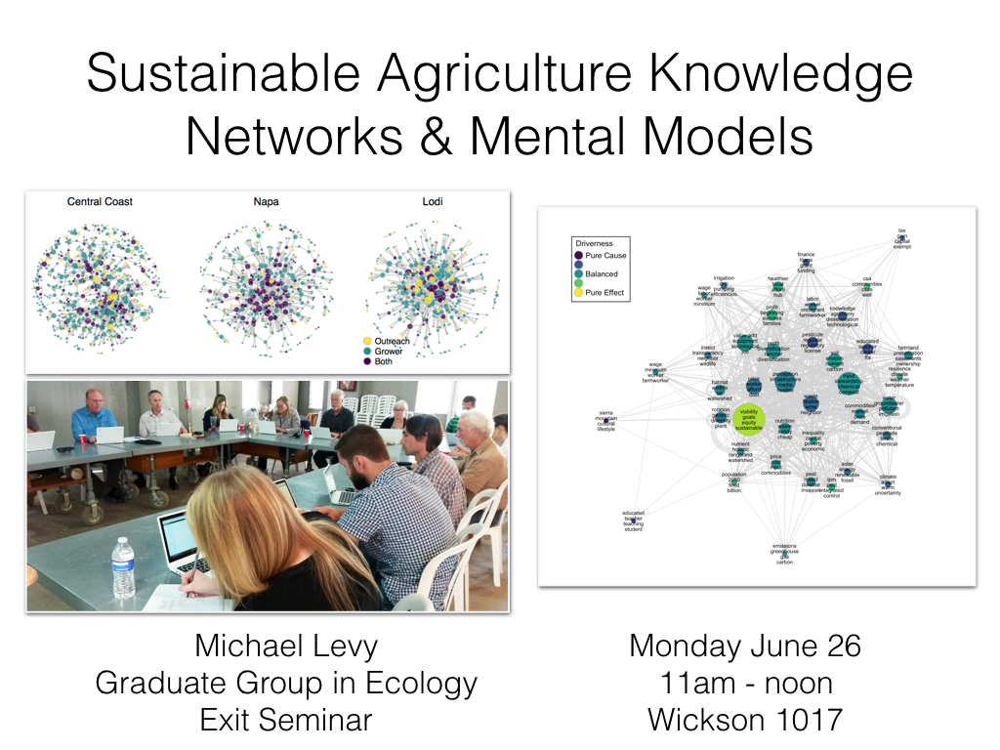

# Dissertation

in partial satisfaction of the requirements for the degree of DOCTOR OF PHILOSOPHY in Ecology in the OFFICE OF GRADUATE STUDIES of the UNIVERSITY OF CALIFORNIA DAVIS

The structure is based on Dave Harris' template, and compiled with:

`pandoc -o dissertation.pdf --bibliography=bib.bib --csl=citation-style.csl -V geometry:margin=1in -V linestretch=2 -V fontsize=12pt --latex-engine=xelatex dissertation.md`

